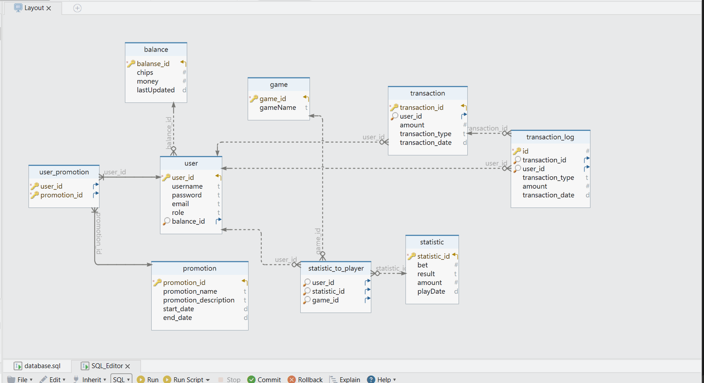

# Описание базы данных Casino

Этот репозиторий содержит структуру базы данных для казино, разработанной с использованием DbSchema.

## Структура базы данных

Ниже приведена визуальная структура базы данных:

## Таблицы

### balance

Таблица `balance` содержит информацию о балансе пользователей в казино.

### game

Таблица `game` содержит информацию о доступных играх в казино.

### statistic

Таблица `statistic` содержит статистику игр пользователей.

### user

Таблица `user` содержит информацию о пользователях казино.

### statistic_to_player

Таблица `statistic_to_player` содержит связи между пользователями, играми и статистикой.

### transaction

Таблица `transaction` содержит информацию о финансовых транзакциях пользователей.

### promotion

Таблица `promotion` содержит информацию о промо-акциях казино.

### user_promotion

Таблица `user_promotion` содержит связи между пользователями и промо-акциями.

### transaction_log

Таблица `transaction_log` содержит журнал всех финансовых транзакций.

## Использование

Эта база данных может быть использована для управления пользователями, играми, статистикой и финансами в казино.

## Визуализация

Для визуализации структуры базы данных использовался инструмент DbSchema.

